# E6：特色求解、可微路径与原生扩展

[Sim Atlas 学习首页](https://github.com/huangkiki/sim-atlas) · [课程](curriculum.md) · [E3 接触/求解](contact-solvers-forces.md) · [E5 批量/数据](batch-learning-data.md)

Newton 的共同数据结构让多个算法共享场景描述，但材料、约束、历史状态和导数仍由具体实现决定。本章沿原生接口解释如何添加计算、选择变形体算法、组合 solver，以及判断一条梯度是否完整。最后将建模→控制→接触→求解→观测串成 B7 的源码阅读路线。

固定 **Newton 1.6.1 / `713fecdc41caf0c9d726f5c016939f36e66e3dff`**；Warp 仍单独固定 **1.18.0 / `f2eaed82d8d03b37bf1014cc975954067fefcf16`**，新增 Tape 证据见[本章独立清单](e6-warp-sources.json)，数组/graph 身份沿用[E5](e5-warp-sources.json)。先修 E3，状态与控制约定见 E1/E2。本文和例子只做源码/AST检查，没有安装、原生 import、模型编译、JIT、物理、渲染、训练或基准结果。A0 的完整安装专题与全课审校仍留 E7。

## 1. 扩展哪一层，决定要承担什么契约

| 原生入口 | 适合放什么 | 必须自行明确的内容 |
|---|---|---|
| 独立 `@wp.kernel`，写 `State.particle_f/body_f` 或 `Control` | 外加力、目标、观测变换 | 单位、坐标、清零/累加顺序、下游 solver 是否真的读这个字段 |
| `ModelBuilder.add_custom_attribute` | 材料/历史/控制的额外字段 | frequency、assignment、namespace、引用重映射、生产/重置/保存者 |
| `SolverBase` 子类 | 新的推进算法 | state_in/out 写入、控制/接触消费、缓存/reset/model change、梯度和碰撞调度 |
| `CouplingInterface` hooks | 让已有 solver 参与原生耦合 | 有效质量、状态被外部修改后的历史同步、proxy 反馈/重力约定 |
| viewer、外部学习框架 | 显示或任务组织 | 不改变上述物理/导数责任，版本也不由 Newton 自动锁定 |

`SolverBase.step(...)` 与 `update_contacts(...)` 基类直接抛 `NotImplementedError`；`reset` 只规范 mask，`register_custom_attributes` 默认不注册额外字段。新类继承了这些名字，不等于已经实现功能。[基类接口](https://github.com/newton-physics/newton/blob/713fecdc41caf0c9d726f5c016939f36e66e3dff/newton/_src/solvers/solver.py#L538-L644)；数据扩展细节沿[E5 第11节](batch-learning-data.md#11-扩展数据的原生入口)。本章的阻力例子直接写 force 并使用已有积分器，不为一个力项再造 solver 框架。

基类还提供 **solver-owned CollisionPipeline** 的调度入口，但固定版本只有 VBD 声明该能力；传给不支持的 solver 或传入另一 Model 的 pipeline 会被拒绝。`CollisionSlot` 区分 RIGID 与 SOFT_SELF_CONTACT；`CollisionFrequencyType` 包含 PRE_INIT、PRE_POST_INIT、ITERATIONS、NONE、AUTO。改变调度后要重新 capture；“每 N 个顶层 step 一次”仍由应用切换 NONE/活动模式，不能把 iteration 频率当成跨 step 定时器。[声明/构造校验](https://github.com/newton-physics/newton/blob/713fecdc41caf0c9d726f5c016939f36e66e3dff/newton/_src/solvers/solver.py#L200-L281)、[调度 setter](https://github.com/newton-physics/newton/blob/713fecdc41caf0c9d726f5c016939f36e66e3dff/newton/_src/solvers/solver.py#L313-L350)、[VBD 实际调用](https://github.com/newton-physics/newton/blob/713fecdc41caf0c9d726f5c016939f36e66e3dff/newton/_src/solvers/vbd/solver_vbd.py#L2272-L2368)

## 2. 先建立能力边界，再进入数值实现

下表是固定源码支持集合，不是性能排名或本仓运行验收。E3 已讲刚体 XPBD、penalty、MuJoCo 与接触力；这里展开先前未深入的分支。

| 路径 | 本章关心的实际机制 | 边界/归属 |
|---|---|---|
| SemiImplicit / Featherstone | particle/cloth/tet 弹性力；前者 maximal、后者 reduced rigid dynamics | Newton/Warp 内核；可微标为 basic，粒子碰撞梯度有限制 |
| VBD | 按着色的顶点/刚体 block 优化，cloth/tet、自接触、ROD、刚软交互 | Newton 原生，实验性；不承诺反传，若干关节字段不消费 |
| Style3D | Projective Dynamics cloth、固定 PD 矩阵与 PCG | 固定 Newton 树内实现；不是此处另接的外部 Style3D 可执行程序 |
| ImplicitMPM | 粒子→FEM 网格→隐式流变/碰撞→粒子 | Newton 原生算法调用 Warp FEM/稀疏计算；不是 tet mesh 积分器，也不积分刚体关节 |
| Kamino PADMM / DVI | maximal 闭环刚体与硬摩擦约束 | Newton 树内后端，实验性；与原生 coupled ADMM 是不同层的算法 |
| SolverMuJoCo | 转换 Model，调用 MuJoCo 或 MuJoCo-Warp | 外部核心；E3 独立依赖证据不等于本机安装或历史运行身份 |
| Hydroelastic | SDF 压力面和接触 reduction | 是接触生成/等效响应的一条路线，不是给每个 shape 自动建立变形体状态 |

[官方 feature matrix](https://github.com/newton-physics/newton/blob/713fecdc41caf0c9d726f5c016939f36e66e3dff/docs/solvers/index.rst#L68-L154)、[Style3D 类与导入](https://github.com/newton-physics/newton/blob/713fecdc41caf0c9d726f5c016939f36e66e3dff/newton/_src/solvers/style3d/solver_style3d.py#L1-L61)、[MPM 入口](https://github.com/newton-physics/newton/blob/713fecdc41caf0c9d726f5c016939f36e66e3dff/newton/_src/solvers/implicit_mpm/solver_implicit_mpm.py#L755-L814)。MuJoCo 依赖仍沿用[E3 独立清单](e3-dependency-sources.json)；外部 Warp、USD/渲染宿主和学习 runtime 各有身份，不能因 Python 包名相同就合并证据。

## 3. 同一个 tetrahedron，在不同 solver 下不一定是同一材料

对初始体积 $V_0>0$、无退化的线性四面体，令 $D_s$ 的列为当前三条边，$D_m^{-1}$ 来自 rest pose，则：

$$
F=D_sD_m^{-1},\qquad J=\det F,\qquad
\mu_L=\frac{E}{2(1+\nu)},\quad
\lambda_L=\frac{E\nu}{(1+\nu)(1-2\nu)}.
$$

F、J、Poisson 比 ν 无量纲，E/μ/λ 为 Pa，V₀ 为 m³；上述 E/ν 转换是各向同性小应变参数关系，通常取 $E>0,-1<\nu<1/2$，不能在 ν=1/2 直接代入。有限应变材料还必须定义能量，而不是只写“Neo-Hookean”。

**SemiImplicit** 先计算 spring、triangle membrane/lift/drag、bending、tet 力，再处理关节/接触并积分。固定 tet kernel 对偏量部分使用 $P_d\propto\mu F(1-1/(I_C+1))$，其中 $I_C=\mathrm{tr}(F^TF)$；另加体积项和阻尼，体积目标含 `tet_activations`。它把材料系数乘 rest volume 后再组装节点力，所以 kernel 中的变量名 `k_mu` 不始终具有 Pa 单位；中途已经变为能量尺度。不要直接把某一中间变量抄作材料参数。[step 消费顺序](https://github.com/newton-physics/newton/blob/713fecdc41caf0c9d726f5c016939f36e66e3dff/newton/_src/solvers/semi_implicit/solver_semi_implicit.py#L147-L215)、[tet 偏量](https://github.com/newton-physics/newton/blob/713fecdc41caf0c9d726f5c016939f36e66e3dff/newton/_src/solvers/semi_implicit/kernels_particle.py#L250-L325)、[体积/激活/力装配](https://github.com/newton-physics/newton/blob/713fecdc41caf0c9d726f5c016939f36e66e3dff/newton/_src/solvers/semi_implicit/kernels_particle.py#L401-L425)

另一个明确边界：`eval_muscle_forces` 虽被导入，SemiImplicit.step 中实际在 `if False` 分支；填写 muscle activation 不能证明这条路径产生肌肉力。[禁用分支](https://github.com/newton-physics/newton/blob/713fecdc41caf0c9d726f5c016939f36e66e3dff/newton/_src/solvers/semi_implicit/solver_semi_implicit.py#L176-L190)

**VBD 的 tet 路径** 采用另一组具体能量参数：源码将输入 Lamé 参数变换为 $\mu_N=\mu_L,\lambda_N=\lambda_L+\mu_L$，并用 $\alpha=1+\mu_N/\lambda_N$。实际分母是 $\lambda_{safe}=\operatorname{sign}(\lambda_N)\max(|\lambda_N|,10^{-6})$；以下取正参数、guard 未触发且无阻尼的条件，其应力对应下面能量密度的梯度（差一个不影响力的常数）：

$$
\psi(F)=\frac{\mu_N}{2}(\mathrm{tr}(F^TF)-3)
+\frac{\lambda_N}{2}(J-\alpha)^2,
\qquad P=\mu_NF+\lambda_N(J-\alpha)\operatorname{cof}(F).
$$

ψ 单位 Pa，V₀ψ 单位 J，节点力是势能对位置的负梯度，单位 N。这里没有把 SemiImplicit 的 $1-1/(I_C+1)$ 因子硬套过来。固定 VBD 实现使用 cofactor 避免在 J≈0 时显式求 F⁻¹；完整 Hessian 的某项在其**单顶点 3×3 block** 中恰好抵消，不代表可以把同一项从任意全局 Hessian 中删除。[真实参数转换、应力和 block Hessian](https://github.com/newton-physics/newton/blob/713fecdc41caf0c9d726f5c016939f36e66e3dff/newton/_src/solvers/vbd/particle_vbd_kernels.py#L173-L265)

这是跨 solver 迁移的重要例子：拓扑/数组可共享，材料离散与参数解释仍需逐 consumer 核对。rest orientation、退化体积、接触离散和步长也影响问题，不能把同 E/ν 当成完整同工况。

## 4. VBD 与 Style3D：两个隐式 cloth/soft 路径

VBD 可从增量势能的局部 block 优化理解。对质量常数、保守弹性、后向位置步的简化情形：

$$
\Phi(x)=\frac{1}{2h^2}(x-y)^TM(x-y)+U(x),\qquad
H_{ii}\Delta x_i=-\nabla_i\Phi.
$$

h 为 s，M 为 kg，x/y 为 m；梯度为 N，Hᵢᵢ 为 N/m。实际实现还加阻尼、摩擦、接触等项，不能用这个简式声称所有非保守过程都有同一势能。按颜色组更新让共享元素的顶点不同时写互相依赖的块；`builder.color()` 生成粒子与刚体颜色，缺失必要颜色组会抛错。[VBD 概念/着色](https://github.com/newton-physics/newton/blob/713fecdc41caf0c9d726f5c016939f36e66e3dff/newton/_src/solvers/vbd/solver_vbd.py#L143-L236)、[粒子校验](https://github.com/newton-physics/newton/blob/713fecdc41caf0c9d726f5c016939f36e66e3dff/newton/_src/solvers/vbd/solver_vbd.py#L919-L932)、[刚体校验](https://github.com/newton-physics/newton/blob/713fecdc41caf0c9d726f5c016939f36e66e3dff/newton/_src/solvers/vbd/solver_vbd.py#L1205-L1219)

固定 VBD.step 分 initialize→交替 rigid/particle iterations→finalize；外部刚体/粒子 shape 接触和内部软体 self-contact 是不同来源，`contacts=None` 不代表关闭所有 self-contact。刚体 compliant ALM 需显式 `rigid_compliant_alm=True`；本版本省略该参数仍关联将要更改的 legacy 默认，不能把“推荐 True”当成当前已启用。有限材料刚度 k 和数值 ALM metric ρ 合成 $k_\mathrm{eff}=k\rho/(k+\rho)$，这不是增加 iterations 就把有限材料变成无限硬体。[两种刚体路径](https://github.com/newton-physics/newton/blob/713fecdc41caf0c9d726f5c016939f36e66e3dff/newton/_src/solvers/vbd/solver_vbd.py#L154-L177)、[step](https://github.com/newton-physics/newton/blob/713fecdc41caf0c9d726f5c016939f36e66e3dff/newton/_src/solvers/vbd/solver_vbd.py#L2272-L2368)

ROD 支持 stretch/shear/bend/twist；其系数有构造期缓存，改变后需 `JOINT_DOF_PROPERTIES` 通知。结构 constraint layout/rest offsets 等需要重建 solver。DISTANCE、不支持的 armature/friction/effort/velocity limit、equality/mimic 边界按固定声明处理，不能从“支持 joint”外推。[ROD/关节字段限制](https://github.com/newton-physics/newton/blob/713fecdc41caf0c9d726f5c016939f36e66e3dff/newton/_src/solvers/vbd/solver_vbd.py#L178-L211)

**Style3D** 用固定 PD 近似矩阵配合当前弹性/接触 RHS，PCG 解增量，再更新位置。对本文的单位约定，其线性子问题可写为 $(M/h^2+P)\Delta x=\mathrm{rhs}$，矩阵单位 N/m、rhs 为 N、增量为 m；P 是算法使用的近似，不能视为每个状态下精确 Hessian。[类内方程](https://github.com/newton-physics/newton/blob/713fecdc41caf0c9d726f5c016939f36e66e3dff/newton/_src/solvers/style3d/solver_style3d.py#L36-L60)、[固定矩阵预计算](https://github.com/newton-physics/newton/blob/713fecdc41caf0c9d726f5c016939f36e66e3dff/newton/_src/solvers/style3d/solver_style3d.py#L411-L441)

原生入口为 `SolverStyle3D.register_custom_attributes(builder)` 与 `newton.solvers.style3d.add_cloth_mesh/add_cloth_grid`。缺少 style3d namespace 或必要属性会抛 AttributeError；各向异性膜/弯曲数据不能由普通 cloth 属性自动替代。`iterations` 是非线性预算，`linear_iterations` 是每轮 PCG 预算；固定 PCG 循环按预算执行并限制到内部容量，没看到 residual tolerance 提前收敛判据，不应写成“达到容差停止”。[构造/拒绝](https://github.com/newton-physics/newton/blob/713fecdc41caf0c9d726f5c016939f36e66e3dff/newton/_src/solvers/style3d/solver_style3d.py#L103-L147)、[属性声明](https://github.com/newton-physics/newton/blob/713fecdc41caf0c9d726f5c016939f36e66e3dff/newton/_src/solvers/style3d/solver_style3d.py#L363-L409)、[PCG.solve](https://github.com/newton-physics/newton/blob/713fecdc41caf0c9d726f5c016939f36e66e3dff/newton/_src/solvers/style3d/linear_solver.py#L340-L379)

尤其注意：Style3D.step 会**原地修改 state_in.particle_q 作为迭代量**，最后写 state_out；因此 E1 的通常双缓冲用法不能推导所有 backend 的输入都只读，也不能直接将该轨迹当成可微反传所需的历史值。[明确输入契约](https://github.com/newton-physics/newton/blob/713fecdc41caf0c9d726f5c016939f36e66e3dff/newton/_src/solvers/style3d/solver_style3d.py#L166-L179)、[位置和速度更新](https://github.com/newton-physics/newton/blob/713fecdc41caf0c9d726f5c016939f36e66e3dff/newton/_src/solvers/style3d/solver_style3d.py#L320-L357)

## 5. ImplicitMPM：网格是计算空间，粒子携带材料历史

`SolverImplicitMPM.register_custom_attributes(builder)` 在构建前声明 `mpm` namespace。颗粒、黏性材料和弹塑性体通过粒子状态与 FEM 网格交换量；不要把 MPM 的“particles”理解成仅做球粒子碰撞。常见数据如下：[字段注册](https://github.com/newton-physics/newton/blob/713fecdc41caf0c9d726f5c016939f36e66e3dff/newton/_src/solvers/implicit_mpm/solver_implicit_mpm.py#L1188-L1220)

| 字段/API | 单位/语义 | 生命周期 |
|---|---|---|
| `mpm.young_modulus`, `poisson_ratio` | Pa、无量纲；弹性参数 | Model per-particle |
| `mpm.damping`, `viscosity` | s 的弹性松弛时间、Pa·s 的塑性黏度 | 与刚体接触 kd 的 N·s/m 不同 |
| `yield_pressure`, `yield_stress`, `friction`, `dilatancy` | 前两项 Pa，后两项无量纲流变参数 | 不是仅修改碰撞表面 μ |
| `State.mpm.particle_elastic_strain` | 实际描述为 elastic deformation gradient；无量纲 mat33 | 不能仅凭 strain 字样当小应变张量 |
| `particle_Jp`, `particle_stress` | 塑性变形梯度行列式、Cauchy stress Pa | 需要随 episode reset 的材料历史 |
| `particle_qd_grad`, `particle_transform` | APIC 速度梯度（s⁻¹）、整体变形梯度（无量纲） | 转移/显示状态，不是额外刚体 pose |
| `Config.voxel_size`, `velocity_basis`, `strain_basis` | 网格尺度 m 与函数空间选择 | 改变离散问题/缓存拓扑 |

可用标准 PIC 的简化关系理解粒子到网格与返回：$m_i=\sum_pN_i(x_p)m_p$、$m_iv_i=\sum_pN_i(x_p)m_pv_p$、$v_p'=\sum_iN_i(x_p)v_i'$。N 无量纲，m 为 kg，v 为 m/s。实际这份隐式实现使用 FEM quadrature、cell volume 归一化与可选 APIC 梯度项，不能据简式替它省去应变/应力与接触求解。

完整路径是 `step` 先把粒子分配到 cell，重建 scratch/function spaces，然后 `_step_impl`：rasterize colliders → 未约束网格速度/质量 → collider rigidity operator → elasticity compliance → plasticity/yield surface → warm start → rheology/contact solve → 保存下一步 warm start → strain/stress 与粒子推进 → 保存 step data。[实际调度](https://github.com/newton-physics/newton/blob/713fecdc41caf0c9d726f5c016939f36e66e3dff/newton/_src/solvers/implicit_mpm/solver_implicit_mpm.py#L1900-L1930)、[完整内步](https://github.com/newton-physics/newton/blob/713fecdc41caf0c9d726f5c016939f36e66e3dff/newton/_src/solvers/implicit_mpm/solver_implicit_mpm.py#L2875-L2936)、[网格初速](https://github.com/newton-physics/newton/blob/713fecdc41caf0c9d726f5c016939f36e66e3dff/newton/_src/solvers/implicit_mpm/solver_implicit_mpm.py#L2938-L2970)、[求解参数传递](https://github.com/newton-physics/newton/blob/713fecdc41caf0c9d726f5c016939f36e66e3dff/newton/_src/solvers/implicit_mpm/solver_implicit_mpm.py#L3476-L3538)

这里 `Control` 和调用方 `Contacts` 参数明确不用，碰撞由内部处理；普通 `state.particle_f` 也未沿该网格未约束速度装配入口传入。想添加外力或耦合不能仅照抄 SemiImplicit 的 force kernel，必须找到 MPM 实际消费入口。`setup_collider` 可给 mesh、body ID、margin(m)、friction、adhesion(Pa)、粒子映射和 world；默认从 COLLIDE_PARTICLES shapes 建立。刚体作为 collider 参与动量交互并不意味着 MPM 独自完成刚体/关节积分。[step 参数契约](https://github.com/newton-physics/newton/blob/713fecdc41caf0c9d726f5c016939f36e66e3dff/newton/_src/solvers/implicit_mpm/solver_implicit_mpm.py#L1901-L1928)、[collider 接口](https://github.com/newton-physics/newton/blob/713fecdc41caf0c9d726f5c016939f36e66e3dff/newton/_src/solvers/implicit_mpm/solver_implicit_mpm.py#L1523-L1592)

流变可配置 GS/Jacobi/CG/CR/GMRES 等或顺序组合，`auto` 按 velocity basis 选择；不是看到 implicit 就能指定“统一 Newton 法”。停止检查作用于 rheology residual 的缩放 L2/L∞量；graph 分支每组 5 次接触/流变求解后更新条件，host 分支也有自己的检查粒度。max_iterations 是数值预算，tolerance 不能解释成空间穿透 m；类概述中的时间稳定性描述也不保证有限迭代、容量和材料输入下的任意步长精度。[Config](https://github.com/newton-physics/newton/blob/713fecdc41caf0c9d726f5c016939f36e66e3dff/newton/_src/solvers/implicit_mpm/solver_implicit_mpm.py#L823-L850)、[停止循环](https://github.com/newton-physics/newton/blob/713fecdc41caf0c9d726f5c016939f36e66e3dff/newton/_src/solvers/implicit_mpm/solve_rheology.py#L1776-L1899)

**隔离与重置有额外规则。**默认 `separate_worlds=False` 共享 FEM 网格，多 world 同坐标粒子可以通过网格相互作用；多 world 隔离需显式 True，且所有 MPM 粒子属于 local world、按 world 连续排列。在该隔离模式中，global static/kinematic collider 可共享，global dynamic collider 被拒绝。[构造检查](https://github.com/newton-physics/newton/blob/713fecdc41caf0c9d726f5c016939f36e66e3dff/newton/_src/solvers/implicit_mpm/solver_implicit_mpm.py#L1391-L1440)、[collider 拒绝条件](https://github.com/newton-physics/newton/blob/713fecdc41caf0c9d726f5c016939f36e66e3dff/newton/_src/solvers/implicit_mpm/solver_implicit_mpm.py#L1560-L1580)

MPM.reset 按 flags 清材料历史，并清粒子与网格 warm-start 历史、更新 collider pose cache；共享多 world 网格的 grid warm start 不能选择性清一个 world，需独立网格或 full reset。它保留粒子 q/qd，不会恢复到 Model 初值。[reset 契约与实现](https://github.com/newton-physics/newton/blob/713fecdc41caf0c9d726f5c016939f36e66e3dff/newton/_src/solvers/implicit_mpm/solver_implicit_mpm.py#L1806-L1894)。外层 graph 有专门 CUDA/内存池/条件节点/容量/固定或可重建网格条件，reset 要放在 capture 外，replay 后用 `check_sparse_grid_rebuild_status()` 检查容量状态；E5 的“Warp 支持 CPU graph”不能覆盖这一后端限制。[MPM graph 契约](https://github.com/newton-physics/newton/blob/713fecdc41caf0c9d726f5c016939f36e66e3dff/newton/_src/solvers/implicit_mpm/solver_implicit_mpm.py#L779-L793)、[状态读回拒绝](https://github.com/newton-physics/newton/blob/713fecdc41caf0c9d726f5c016939f36e66e3dff/newton/_src/solvers/implicit_mpm/solver_implicit_mpm.py#L1599-L1634)

## 6. Kamino：DVI、PADMM 和积分器是三个不同选择维度

Kamino 用 maximal 刚体变量处理闭环机构、接触和关节约束。E3 已追 PADMM residual，本节看 DVI 的问题分解。以物理约束冲量 λ（平移 N·s、转动 N·m·s）和约束后速度为例：

$$
v^+=D\lambda+v_f,\qquad
D_{bb}\lambda_b=-(v_{f,b}+D_{bu}\lambda_u).
$$

b 是 bilateral，u 是 unilateral。D 将冲量映射为约束速度；平移块可具有 1/kg 单位，混合平移/转动系统不能给整矩阵一个统一的标量单位。DVI 固定实现对 bilateral 块作直接解，对 limits/摩擦 contact 走着色 projected Gauss–Seidel，并交替重新解 bilateral 块；若只按关节一次→接触一次，就没有得到两者的完整相互反馈。[DVI 方程/约束语义](https://github.com/newton-physics/newton/blob/713fecdc41caf0c9d726f5c016939f36e66e3dff/newton/_src/solvers/kamino/_src/solvers/dvi/solver.py#L58-L71)、[实际块解与循环](https://github.com/newton-physics/newton/blob/713fecdc41caf0c9d726f5c016939f36e66e3dff/newton/_src/solvers/kamino/_src/solvers/dvi/solver.py#L745-L857)

法向 limit 用非负互补，friction contact 在 De Saxce 速度修正后处理 Coulomb cone；这与 E3 penalty force、E6 coupled ADMM 的局部接触投影不是同一个算法。`SolverKamino.Config(dynamics_solver="dvi")` 在构造时确定关联默认；DVI 要求 `dynamics.preconditioning=False`，违例显式抛错，以保持接触 cone 和停止检查的物理单位。PADMM 的 adaptive penalty 还要求 sparse dynamics；不能在不同配置之间只比较 iterations 数。[配置拒绝](https://github.com/newton-physics/newton/blob/713fecdc41caf0c9d726f5c016939f36e66e3dff/newton/_src/solvers/kamino/solver_kamino.py#L441-L459)

两后端的 `status` 都有 converged/iterations/r_p/r_d/r_c，但定义不同。DVI 的 r_p 是冲量到 cone 的距离，r_d 是速度到 dual cone 或 bilateral 速度误差，r_c 是冲量与速度的互补残差（J）；PADMM 的 r_p/r_d 是 consensus/dual 残差，再通过 P/P⁻¹ 从预条件变量换回物理约束单位（冲量/速度）；它们不是未经换算的原始缩放量，但与 DVI 的定义仍不同。相同字段名不授权统一阈值。[逐字段定义](https://github.com/newton-physics/newton/blob/713fecdc41caf0c9d726f5c016939f36e66e3dff/docs/solvers/kamino.rst#L75-L102)

`integrator="euler"/"moreau"` 又是另一个选择。Moreau 路径先推进半步 configuration，在中点调用 forward，再用更新后的 twist 推进另半步；姿态用 log-map，而不是对四元数四个数当普通向量平均。公开配置说明 Moreau 需要内部 collision detector，使中点状态和接触相匹配；该模块明确 `enable_backward=False`。[选项条件](https://github.com/newton-physics/newton/blob/713fecdc41caf0c9d726f5c016939f36e66e3dff/newton/_src/solvers/kamino/solver_kamino.py#L266-L272)、[中点顺序](https://github.com/newton-physics/newton/blob/713fecdc41caf0c9d726f5c016939f36e66e3dff/newton/_src/solvers/kamino/_src/integrators/moreau.py#L250-L304)、[半步更新/禁用反传](https://github.com/newton-physics/newton/blob/713fecdc41caf0c9d726f5c016939f36e66e3dff/newton/_src/solvers/kamino/_src/integrators/moreau.py#L39-L85)。本章不把官方文档的快慢/鲁棒性经验写成本仓测量。

## 7. 原生多 solver 耦合：先划分所有权

公开入口是 `newton.solvers.experimental.coupled`，不是 `newton.solvers.SolverCoupledADMM` 等平铺符号。模块 lazy import 不代表算法可微或稳定 ABI。[公开命名空间](https://github.com/newton-physics/newton/blob/713fecdc41caf0c9d726f5c016939f36e66e3dff/newton/solvers.py#L18-L68)

`SolverCoupled.Entry` 通过 `solver(view)` 工厂建立子 solver，并指定 bodies、particles、joints、shapes、substeps 等。`ModelView` 在共享 Model 上建立局部覆盖与局部索引映射；读取可能回落到 parent，受控修改才走 copy-on-write。直接写返回的共享 Warp 数组不会触发自动拦截，不能当成独立 Model 的深拷贝。[views/ownership 概念](https://github.com/newton-physics/newton/blob/713fecdc41caf0c9d726f5c016939f36e66e3dff/docs/concepts/coupling.rst#L48-L96)、[ModelView get/set](https://github.com/newton-physics/newton/blob/713fecdc41caf0c9d726f5c016939f36e66e3dff/newton/_src/solvers/coupled/model_view.py#L61-L120)

构造器建立 owner map，重复名字、越界 ID 或同一实体被两个 entry 拥有会拒绝。顶层 step 分 distribute→子算法→复制公共未覆盖量→reconcile owned outputs；每个 entry 若有 S 个子步，用 h=dt/S，内部缓冲和最后结果归位由耦合器处理。[校验](https://github.com/newton-physics/newton/blob/713fecdc41caf0c9d726f5c016939f36e66e3dff/newton/_src/solvers/coupled/solver_coupled.py#L526-L544)、[顶层调度](https://github.com/newton-physics/newton/blob/713fecdc41caf0c9d726f5c016939f36e66e3dff/newton/_src/solvers/coupled/solver_coupled.py#L2203-L2223)、[entry 子步](https://github.com/newton-physics/newton/blob/713fecdc41caf0c9d726f5c016939f36e66e3dff/newton/_src/solvers/coupled/solver_coupled.py#L2662-L2703)

新后端继承/实现 `CouplingInterface` 时，需要沿真实需求覆写：

| Hook/入口 | 解决的问题 | 不能默默假设 |
|---|---|---|
| `coupling_notify_input_state_update` | 公共 pose/velocity/force 被耦合器改写，或 iteration restart | 旧 solver history 会自动同步 |
| `coupling_eval_gravity_acceleration` | solver 实际施加的 gravity-like acceleration | 一律等于 Model.gravity，或应重复加 g |
| `coupling_eval_effective_mass(_block)` | 端点质量、惯量，body 点还依赖机构约束 | raw body mass 等于 articulated effective mass |
| rewind/harvest proxy hooks | 去掉已施加反馈、报告本轮相互作用 | 动量差始终可分离出纯接触力 |
| `notify_model_changed` | view 虚拟/近端质量改变后刷新缓存 | 写了 body_mass 就已更新所有逆量/后端常数 |

该 mixin 有默认实现；不适用时应明确抛 `NotImplementedError`，而不是让默认质量/历史看似合法。接口给 effective mass 的单位 kg、inertia 的单位 kg·m²。强制输入仍走 public force/control 缓冲及正常 step，具体消费与第5节 MPM 差异一起检查。[hook 契约](https://github.com/newton-physics/newton/blob/713fecdc41caf0c9d726f5c016939f36e66e3dff/newton/_src/solvers/coupled/interface.py#L110-L255)、[官方耦合约定](https://github.com/newton-physics/newton/blob/713fecdc41caf0c9d726f5c016939f36e66e3dff/docs/concepts/coupling.rst#L99-L139)

## 8. Proxy：延迟反馈不等于重复推进时间

Proxy 将 source 拥有的实体映射成 destination 中的代理端点，可设置虚拟 `mass_scale`，再回收相互作用反馈。LAGGED 同步 source 的起点 pose/末端 velocity 并 rewind 已施加反馈、外力和重力；STAGGERED 同步末端 pose/velocity，跳过通用 lagged rewind。[算法差异](https://github.com/newton-physics/newton/blob/713fecdc41caf0c9d726f5c016939f36e66e3dff/docs/concepts/coupling.rst#L143-L225)

通用刚体 harvest 估计为：

$$
f=\frac{m(v_{after}-v_{before})}{h},\qquad
\tau=\frac{R I_B R^T(\omega_{after}-\omega_{before})}{h}.
$$

f 为 N，τ 为 N·m；速度与转矩都用 world 轴、body inertia I_B 关于质心。该式忽略有限转动下惯量变化等细节，只是固定实现的动量差 fallback；不能说它必然等于精确 contact wrench。VBD 可用原生 contact force harvest，MPM 用 collider impulse/transfer 路径，通常比不区分来源的动量差更有针对性。[fallback 代码](https://github.com/newton-physics/newton/blob/713fecdc41caf0c9d726f5c016939f36e66e3dff/newton/_src/solvers/coupled/proxy_utils.py#L146-L177)、[后端 hooks](https://github.com/newton-physics/newton/blob/713fecdc41caf0c9d726f5c016939f36e66e3dff/docs/concepts/coupling.rst#L340-L373)

固定 relaxation 可写 $f^{k+1}=(1-\omega)f^k+\omega\hat f^{k+1}$；ω 无量纲，减小 ω 会改变反馈迭代，不是改变真实材料阻尼。实现还提供 Aitken 分支，本节公式仅对应固定 relaxation。每次 inner iteration **重解同一个 dt 区间**，k>0 会从最初分发状态重启，仅保留反馈，不应把时间累加 iterations×dt。[循环重启](https://github.com/newton-physics/newton/blob/713fecdc41caf0c9d726f5c016939f36e66e3dff/newton/_src/solvers/coupled/solver_coupled_proxy.py#L1316-L1335)、[relaxation 分支](https://github.com/newton-physics/newton/blob/713fecdc41caf0c9d726f5c016939f36e66e3dff/newton/_src/solvers/coupled/solver_coupled_proxy.py#L1136-L1188)

当前 generic Proxy 最多两个 entries，构造时显式限制；proxy joint target 同步只支持 1-DOF，不能把球关节 target layout 直接照搬。[entry 数拒绝](https://github.com/newton-physics/newton/blob/713fecdc41caf0c9d726f5c016939f36e66e3dff/newton/_src/solvers/coupled/solver_coupled_proxy.py#L295-L310)、[joint 同步拒绝](https://github.com/newton-physics/newton/blob/713fecdc41caf0c9d726f5c016939f36e66e3dff/newton/_src/solvers/coupled/solver_coupled_proxy.py#L918-L930)

## 9. Coupled ADMM：接口行、权重和拒绝分支

这是子 solver 之间的接口算法，不是 Kamino 内部 PADMM。它从跨 entry model joint、body-particle attachment 与启用的 ContactPair 建立行，每轮恢复 entry 起点、施加 proximal shift/反馈，运行子 solver，再更新接口变量与 dual。迭代次数固定；增加 iteration 是求同一个区间的一致解，不延长物理时间。[ADMM 调度](https://github.com/newton-physics/newton/blob/713fecdc41caf0c9d726f5c016939f36e66e3dff/newton/_src/solvers/coupled/solver_coupled_admm.py#L2861-L2923)

一个二次接口行的固定实现为：

$$
u^{k+1}=\frac{\rho W^2Jv+\kappa u_{target}-W\lambda^k}
{\kappa+d+\rho W^2},\qquad
\lambda^{k+1}=\lambda^k+\rho W(u^{k+1}-Jv).
$$

这里 `u`/`Jv` 是该行的相对速度变量；平移行单位 m/s，角行 rad/s，κ/d 是代码组装后的行系数，不能无视 h 的转换直接把它们等同输入的 N/m 和 N·s/m。W 对两个正有效质量采用 $\sqrt{m_am_b/(m_a+m_b)}$，平移端点时单位 √kg；单侧正质量走该侧平方根，两侧都非正返回数值 fallback 1。以上是具体 kernel 变量更新，不声称 dual λ 本身就是最终物理力。[权重](https://github.com/newton-physics/newton/blob/713fecdc41caf0c9d726f5c016939f36e66e3dff/newton/_src/solvers/coupled/admm_utils.py#L27-L56)、[局部/dual 更新](https://github.com/newton-physics/newton/blob/713fecdc41caf0c9d726f5c016939f36e66e3dff/newton/_src/solvers/coupled/admm_utils.py#L737-L767)

接触行用 gap/h（穿透时再乘 baumgarte）构造最低法向速度，并调用 isotropic Coulomb maximum-dissipation projection；源码明确这不是直接求 cone complementarity。材料摩擦来自 Model，不是 ContactPair 上的一个万能字段。私有 contact 数据有自己的容量/匹配/warm start；调用者传入 Contacts 不自动成为 ADMM 接口行。[法向速度目标](https://github.com/newton-physics/newton/blob/713fecdc41caf0c9d726f5c016939f36e66e3dff/newton/_src/solvers/coupled/admm_utils.py#L58-L65)、[接触投影](https://github.com/newton-physics/newton/blob/713fecdc41caf0c9d726f5c016939f36e66e3dff/newton/_src/solvers/coupled/admm_utils.py#L836-L885)、[私有 stream 约定](https://github.com/newton-physics/newton/blob/713fecdc41caf0c9d726f5c016939f36e66e3dff/docs/concepts/coupling.rst#L248-L307)

| 跨 entry 约束情况 | 固定实现结果 |
|---|---|
| BALL/FIXED/REVOLUTE，joint 本身不归某个子 solver | 建立支持的 anchor/角度/摩擦行，避免重复求解 |
| FREE/DISTANCE | `continue`，没有自动建立接口约束；DISTANCE 不是“被求成柔顺距离” |
| PRISMATIC/D6 等其他类型 | `NotImplementedError`，不能依靠子 solver 各自支持来绕过接口缺项 |
| 两端同 entry 或未被拥有 | 该类 attachment 不成为跨 solver 行 |
| full-surface rigid-soft edge/face contact | 只有声明支持的 VBD entry 保留；必须拥有全部被引用角点，跨两个 entry 的记录会被两边丢弃 |

[关节映射/忽略/拒绝](https://github.com/newton-physics/newton/blob/713fecdc41caf0c9d726f5c016939f36e66e3dff/newton/_src/solvers/coupled/solver_coupled_admm.py#L2530-L2637)、[attachment 契约](https://github.com/newton-physics/newton/blob/713fecdc41caf0c9d726f5c016939f36e66e3dff/docs/concepts/coupling.rst#L229-L250)、[full-surface 实际过滤](https://github.com/newton-physics/newton/blob/713fecdc41caf0c9d726f5c016939f36e66e3dff/newton/_src/solvers/coupled/solver_coupled.py#L3687-L3713)。几何接触存在不等于所有子 solver 都会收到其全部表示。

## 10. 可微仿真是整条执行链的性质

对离散推进 $s_{k+1}=F_h(s_k,u_k,\theta)$，先假设初态 $s_0$ 和给定控制序列 $u_k$ 均独立于参数 θ，loss 仅依赖终态，即 $L=\ell(s_N)$。定义 $\bar s_N=\nabla_{s_N}\ell$，则反向递推为：

$$
\bar s_k=(\partial F_h/\partial s_k)^T\bar s_{k+1},\qquad
\frac{dL}{d\theta}=\sum_k(\partial F_h/\partial\theta)^T\bar s_{k+1}.
$$

若初态或控制依赖 θ，且 $\ell=\ell(s_N,\theta)$，还必须加上 $({d s_0}/{d\theta})^T\bar s_0$、$\sum_k({d u_k}/{d\theta})^T(\partial F_h/\partial u_k)^T\bar s_{k+1}$ 和 loss 的直接项 $\partial\ell/\partial\theta$。这里控制序列按给定的参数化输入理解；若 $u_k=\pi(s_k,\theta)$ 是反馈策略，应先将 π 复合进 $F_h$ 再求状态/参数 Jacobian。每步 loss 也需在对应 adjoint 递推中加入其梯度。第11节对初速度 $v_0$ 求导走的是**初态链式项**，不能只套上面的动力学参数求和式。

这是**离散程序**的导数；改变 h、迭代预算、截断/clamp 或接触集合会改变函数。`requires_grad=True` 只建立梯度存储/相应路径，不保证每个操作有正确 adjoint。固定 feature matrix 只给 SemiImplicit/Featherstone 标 basic；不能据 Warp 默认生成 adjoint 就宣称 VBD、MPM、XPBD、Kamino、Style3D 或耦合系统端到端可微。[Newton 可微入口](https://github.com/newton-physics/newton/blob/713fecdc41caf0c9d726f5c016939f36e66e3dff/docs/solvers/index.rst#L418-L465)

Warp Tape 记录 launch，`backward(loss)` 要求带梯度的单元素 loss，然后逆序调用 adjoint；遇到禁用 backward 的记录会警告并跳过相应反传。`Tape.zero()` 清梯度，`Tape.reset()` 还清 launch 列表。它们不是 Model/State episode reset。[Tape.backward](https://github.com/NVIDIA/warp/blob/f2eaed82d8d03b37bf1014cc975954067fefcf16/warp/_src/tape.py#L70-L175)、[zero/reset](https://github.com/NVIDIA/warp/blob/f2eaed82d8d03b37bf1014cc975954067fefcf16/warp/_src/tape.py#L309-L333)

反传通常需要每一步的前向值，因此教学例子为每个时间点分配独立 State。普通 forward 的两缓冲复用会覆盖旧值，不能直接搬进长轨迹 Tape。Warp 默认消费/清除输出梯度；`retain_grad=True` 也不是修复覆写的方法，在同一元素被多次写入时反而可能双重计数。[所有权/覆写规则](https://github.com/NVIDIA/warp/blob/f2eaed82d8d03b37bf1014cc975954067fefcf16/docs/user_guide/differentiability.rst#L8-L58)。Featherstone 确有 requires_grad 分支和附着于 state 的辅助变量，说明相同 solver 在可微与复用 scratch 模式下有不同内存需求。[实际分支](https://github.com/newton-physics/newton/blob/713fecdc41caf0c9d726f5c016939f36e66e3dff/newton/_src/solvers/featherstone/solver_featherstone.py#L393-L485)

**接触是额外边界。**CollisionPipeline.collide 可在 Tape 内调用，但 broad/narrow phase 的非可微 launch 显式 `record_tape=False`；可微 soft-contact/rigid augmentation 另行记录。`newton.eval_rigid_contact_kinematics` 从冻结的 local support points、world normal 和 margins 重建：

$$
d=n^T(p_b-p_a)-(m_a+m_b).
$$

d/margin 为 m，n 为固定单位法线。导数穿过 body pose 到 world point/distance，不穿过离散 contact set 或法线变化，是一阶切平面近似。输出数组存在梯度，不证明接触出现/消失、特征切换或完整 solver contact force 也可微。[公开契约](https://github.com/newton-physics/newton/blob/713fecdc41caf0c9d726f5c016939f36e66e3dff/newton/_src/sim/contact_kinematics.py#L35-L78)、[距离 writer](https://github.com/newton-physics/newton/blob/713fecdc41caf0c9d726f5c016939f36e66e3dff/newton/_src/geometry/differentiable_contacts.py#L30-L95)、[collision Tape 边界](https://github.com/newton-physics/newton/blob/713fecdc41caf0c9d726f5c016939f36e66e3dff/newton/_src/sim/collide.py#L2147-L2166)

SemiImplicit 还明确警告 particle-particle contact kernel 可能破坏梯度；可微用例可关闭 `model.particle_grid`，但这也改变物理相互作用，不能隐藏。官方 diffsim ball 示例复用一次生成的简单固定几何接触、保存全部时间 State，再 Tape/backward；不能从该演示推导任意动态 mesh 碰撞都有正确导数。[粒子接触警告](https://github.com/newton-physics/newton/blob/713fecdc41caf0c9d726f5c016939f36e66e3dff/newton/_src/solvers/semi_implicit/solver_semi_implicit.py#L124-L147)、[官方例子的限定布局](https://github.com/newton-physics/newton/blob/713fecdc41caf0c9d726f5c016939f36e66e3dff/newton/examples/diffsim/example_diffsim_ball.py#L85-L140)。Proxy/ADMM 多个核心 kernel 明确 `enable_backward=False`，组合可微子 solver 也不自动获得可微耦合。[耦合 kernel](https://github.com/newton-physics/newton/blob/713fecdc41caf0c9d726f5c016939f36e66e3dff/newton/_src/solvers/coupled/proxy_utils.py#L27-L55)、[ADMM dual](https://github.com/newton-physics/newton/blob/713fecdc41caf0c9d726f5c016939f36e66e3dff/newton/_src/solvers/coupled/admm_utils.py#L755-L768)

## 11. 原创最小例子：阻力项如何进入 forward 和 backward

[examples/e6_differentiable_drag.py](../examples/e6_differentiable_drag.py) 使用一个质量 m 的自由粒子、零重力、无接触；独立 kernel 写 $f=-cv$，然后调用原生 SolverSemiImplicit。c 为 kg/s（N·s/m），四步各用独立 State，在 Tape 内计算终点平方距离；没有优化器、训练循环或运行产物。

在本例条件、速度 clamp 未触发且 $0<hc/m<1$ 时，令 r=1−hc/m，可手推：

$$
v_k=r^kv_0,\qquad x_N=x_0+h\sum_{j=1}^{N}r^jv_0,\qquad
\frac{\partial L}{\partial v_0}=2h\left(\sum_{j=1}^{N}r^j\right)(x_N-x_*).
$$

对阻力系数还可沿动力学参数路径得到 $\partial L/\partial c=-2h^2m^{-1}(\sum_{j=1}^{N}j r^{j-1})v_0^T(x_N-x_*)$，单位 m²·s/kg。L 单位 m²，初速度梯度单位 m·s。这提供日后运行时可用的解析检查方向，但本阶段没有计算原生梯度或做 finite difference。例子将 `particle_grid=None` 明确写出，并且不存在 shape/triangle/tet，避免从一个简单可微例子暗示接触/弹性全面有效。`particle_f` 每步先清再写，属于每个独立 State；最后 `.numpy().copy()` 仅展示日后保留读回值的所有权。[实际粒子积分](https://github.com/newton-physics/newton/blob/713fecdc41caf0c9d726f5c016939f36e66e3dff/newton/_src/solvers/solver.py#L25-L63)、[SemiImplicit 力→积分](https://github.com/newton-physics/newton/blob/713fecdc41caf0c9d726f5c016939f36e66e3dff/newton/_src/solvers/semi_implicit/solver_semi_implicit.py#L151-L215)

扩展时若 kernel 改成阻尼/饱和/分段控制，需重新定义可导区域；若引入 collision 或换 solver，必须重新沿 producer/consumer 核对，不能保留本例的梯度假设不变。

## 12. B7：完整追踪一个原生驱动机器人步

以下以 E2 的 scalar DrivePD + XPBD、E3 的力读回和 E4 的 Contact sensor 为连接实例，是**源码阅读次序**，不是新增实验或把各章例子拼成已运行系统。

```mermaid
flowchart LR
  B[Builder: shape/joint/actuator] --> M[Model: topology and parameters]
  M --> S[State: body and joint arrays]
  S --> IK[eval_ik: feedback coordinates]
  IK --> C[Control: target and accumulated effort]
  C --> P[CollisionPipeline: contact geometry]
  P --> X[XPBD: prediction and constraints]
  X --> U[State out and impulse readback]
  U --> O[SensorContact / viewer / data record]
```

| 阅读站点 | 实际字段/动作 | 要回答的问题 |
|---|---|---|
| [E2 原生模型例子](../examples/e2_scalar_drive.py) | link/shape/revolute、articulation、DrivePD 和 effort clamp | target 是角度还是努力值？为什么 solver-native gain 设零？ |
| [Model.state/control](https://github.com/newton-physics/newton/blob/713fecdc41caf0c9d726f5c016939f36e66e3dff/newton/_src/sim/model.py#L1809-L1934) | 初始数组 clone、Model 默认控制、目标布局 | 哪些数组独立，哪些可 alias？q 和 qd 的 starts 是否不同？ |
| [E2 actuator 到 solver 链](control-robotics-tasks.md) | XPBD maximal body 为权威，eval_ik 重建关节反馈，clear forces、clear joint_f、actuator.step | 正在计算当前 pose 的反馈，还是旧关节数组？有没有重复驱动？ |
| [CollisionPipeline.collide](https://github.com/newton-physics/newton/blob/713fecdc41caf0c9d726f5c016939f36e66e3dff/newton/_src/sim/collide.py#L2137-L2166) | counters/generation、broad/narrow、matching/reduction | 几何在哪个时刻生成？容量溢出是否使观测无效？ |
| [XPBD.step](https://github.com/newton-physics/newton/blob/713fecdc41caf0c9d726f5c016939f36e66e3dff/newton/_src/solvers/xpbd/solver_xpbd.py#L389-L569) | 临时 joint force、预测积分、constraint iteration | 该字段被消费还是忽略？迭代和子步如何区分？ |
| [XPBD contact impulse 保存](https://github.com/newton-physics/newton/blob/713fecdc41caf0c9d726f5c016939f36e66e3dff/newton/_src/solvers/xpbd/solver_xpbd.py#L835-L855) / [update_contacts](https://github.com/newton-physics/newton/blob/713fecdc41caf0c9d726f5c016939f36e66e3dff/newton/_src/solvers/xpbd/solver_xpbd.py#L1060-L1116) | 位置修正等效 impulse，除 `_last_dt`；后续恢复速度另处理 | 为什么该力不等于所有恢复/接触过程的精确 wrench？ |
| [E4 SensorContact](sensors-rendering.md) | 线性 force 的 flat row 聚合、参考坐标和采样阶段 | 存储已分配是否有有效 producer？sensor 输出与 pose 是否同一阶段？ |
| [E5 数据生命周期](batch-learning-data.md) | 独立快照、物理时钟、版本/单位/实体映射、reset | 回放用于显示还是继续求解？有什么状态未保存？ |

读完这条链，应能自己填写“字段定义→写者→读者→单位/坐标→更新时间→失效条件”的六列。换成 MPM 时，Control/外部 Contacts 两站就要改写；换 Style3D 时，输入只读假设要改写；换 MuJoCo 时，还要进入独立后端版本。这是完整追踪方法的用途，而非将 solver 抽象成完全等价的黑箱。

Hydroelastic 则可以在 collision 站向下展开：双方 SDF/pressure 条件→面片压力积分→reduction→导出的接触刚度/点→支持该路径的 solver。`kh` 为 N/m³，不等于 Young 模量 Pa；plane/heightfield 的 hydroelastic flag 有拒绝/关闭处理，详见[E3 原生材料链](contact-solvers-forces.md)。它不取代本章的 cloth/tet/MPM 变形状态。

## 13. 阅读练习与答案

1. 想加入线性粒子阻力，为什么优先用 force kernel + 现有 SemiImplicit，而不是先写一个新 SolverBase 子类？
2. 两个 solver 都写 Neo-Hookean，给相同 Lamé 参数是否足以说明实现相同？
3. Style3D 的 `linear_iterations=10` 能否解释成 residual 小于 1e−10？state_in 是否只读？
4. MPM 的粒子都有不同 local world ID，默认配置下是否保证同坐标材料互不影响？
5. MPM.step 的 Contacts/Control 有参数，是否证明它消费外部碰撞和关节目标？
6. DVI 为什么交替解 bilateral 与 unilateral？其 r_p 能否直接套 PADMM 的阈值解释？
7. Proxy 4 次 inner iterations、entry 各 2 substeps，顶层 dt=8 ms，推进多少时间？
8. ADMM 两端分别归不同 entry 的 DISTANCE joint 是被求解、抛错还是跳过？PRISMATIC 呢？
9. 一条 edge/face rigid-soft contact 的三个角点分属两个 entries，为什么不是每边各求一部分？
10. 在 Tape 中调用 collide，是否代表 broad phase/contact set/normal 都可微？
11. `retain_grad=True` 能否补救两个 State 循环覆写的全部轨迹？Tape.reset 是 episode reset 吗？
12. 原生示例中增加一个 tet、一个接触 plane，或换成 MPM，是否还能沿用阻力梯度解析式？

### 参考答案

1. 现有积分器已消费 `particle_f`；新增的是力模型，不是积分/约束算法。要明确清零/累加、单位、写入阶段和梯度。换到不读该字段的后端则要重新找消费者。
2. 不足。本章追到 SemiImplicit 的偏量因子与 VBD 的 Lamé→能量参数转换不同；离散、阻尼、激活和体积项也需要对齐。
3. 不能；它是 PCG 固定迭代预算，不是一个带指数的容差。Style3D 会原地修改输入 particle_q。
4. 不保证。默认共享 FEM 网格；多 world 独立需要 separate_worlds=True 及 local/连续布局等条件，隔离是后端数值空间的配置。
5. 不证明，固定 step 明确忽略二者并使用内部 collider/流变路径。Python 签名是共同入口，不是支持证明。
6. 两类冲量互相影响；只解一次会漏掉后续反馈。DVI 的 cone 距离与 PADMM 的 consensus residual 不同，字段同名不能统一解释。
7. 仍是 8 ms；每个 entry 的物理子步是 4 ms。4 次耦合迭代重解同一个区间，不应累计成32 ms。
8. DISTANCE 和 FREE 跳过；PRISMATIC 走未支持类型的 NotImplementedError。必须分别记录缺失和拒绝，不能都标支持。
9. 固定过滤器要求 entry 拥有全部被引用角点，且后端支持 full-surface 表示；跨 entry 的这条记录会被两边丢弃，不存在自动拆分算法。
10. 不代表。非可微检测不入 Tape；刚体 kinematics 仅在冻结集合/normal 上对 pose 求切向近似导数。
11. 不能。保留梯度不恢复已覆盖的前向值，多次写还可能双重计数；Tape.reset 清录制与梯度，不重置 solver/history/task。
12. 不能。解析式假定单粒子、无接触、零重力和固定线性阻力积分；新增相互作用或换消费者后已是另一个离散函数。

## 14. 验收与剩余范围

[本章静态验收](e6-validation.md)记录身份、锚点、AST、公式假设和明确保留的能力缺口。B0/B4 的专项扩展、B6 原生扩展与 B7 完整源码追踪已具备课程内容；不是所有底层库、材料模型、后端性能或梯度都已运行验证。E7 仍须补齐 A0、审校两条路线与版本导航，并整理 [DexLab](https://github.com/huangkiki/Dexlab) 原始版本/工况证据索引；不新建实验批次。
